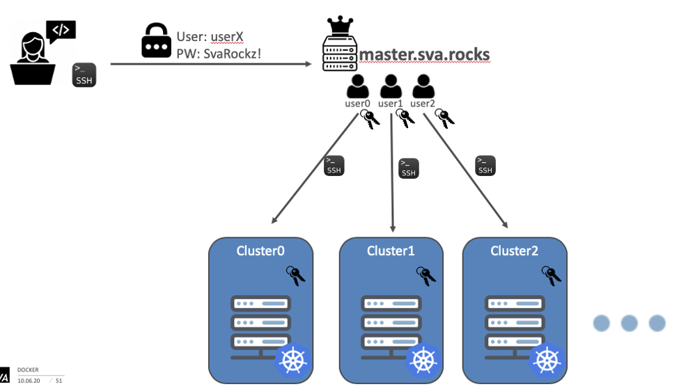

Jeder User hat seinen eigenen Cluster bestehend aus 4 Servern.


Der zentrale Login erfolgt über master.sva.rocks. Die Verbindung zum Server erfolgt über SSH.

Der Benutzername besteht immer aus “user” und einer dir zugeteilten Nummer. Beispielsweise user11.

Das Passwort für den Server ist dann: SvaRockz!


Falls du keinen SSH Client installiert hast, kannst du dieses Webterminal benutzen:

https://master.sva.rocks/wetty

Um dir deine Server anzeigen zu lassen kannst du das Kommando `host_list` ausführen:

```
[user0@ultramaster ~]$ host_list
kube0-master 116.203.194.84
kube0-worker-0 116.203.218.104
kube0-worker-1 116.203.199.207
kube0-worker-2 116.203.203.127
```