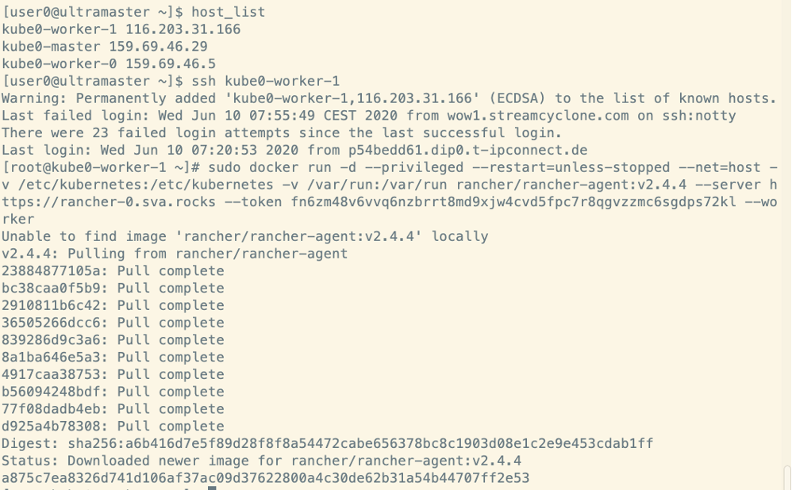

# Aufgabe 1 - Rancher installieren
Ausrollen des Rancher Containers auf dem Master-Server: kube$ID-master
```
docker run -d --restart=unless-stopped \
  -p 80:80 -p 443:443 \
  --privileged \
  rancher/rancher:latest \
  --acme-domain rancher-$ID.sva.rocks
```

Danach auf `https://rancher-$ID.sva.rocks` um das Passwort zu setzen:

 

Danach muss die URL für den Cluster gesetzt werden. Das sollte automatisch richtig gesetzt sein:


 

Damit wir nun den Cluster aufsetzen können müssen wir diesen anlegen:


Dabei wählen wir die Option “From existing nodes (Custom)”:


Um den Cluster anzulegen müssen wir mindestens einen Namen definieren:


Die anderen Parameter können so bleiben wie sie sind. Danach können wir das anlegen des Clusters mit “Next” bestätigen:


 
Anschließend bekommen wir die Möglichkeit Kommandos für das Hinzufügen von Cluster nodes zu generieren.
Dabei ist zu unterscheiden, dass es Master und Worker Nodes gibt.
Unser Cluster besteht aus einem Master und 3 Workern.

**Master**: `kube-$ID-master`

Für den Master wählt ihr etcd und Control Plane als Rolle aus und kopiert den Befehl:


 
Danach geht es vom “ultramaster” aus via SSH zu eurem Master und führt dort das kopierte Kommando aus:


Mit einem exit könnt ihr nun die SSH Verbindung zu eurem Master beenden und kommt wieder zurück zum “ultramaster”.

**Worker**: `kube-$ID-worker-0`; `kube-$ID-worker-1`;  `kube-$ID-worker-2`

Für eure Worker wählt ihr lediglich die Rolle Worker:


Danach geht es dann wieder via SSH zu den Workern, wo wiederum der kopierte Befehl für die Worker ausgeführt wird:



Sobald dies für alle Worker abgeschlossen ist können wir den dialog mit **Done** Bestätigen.


