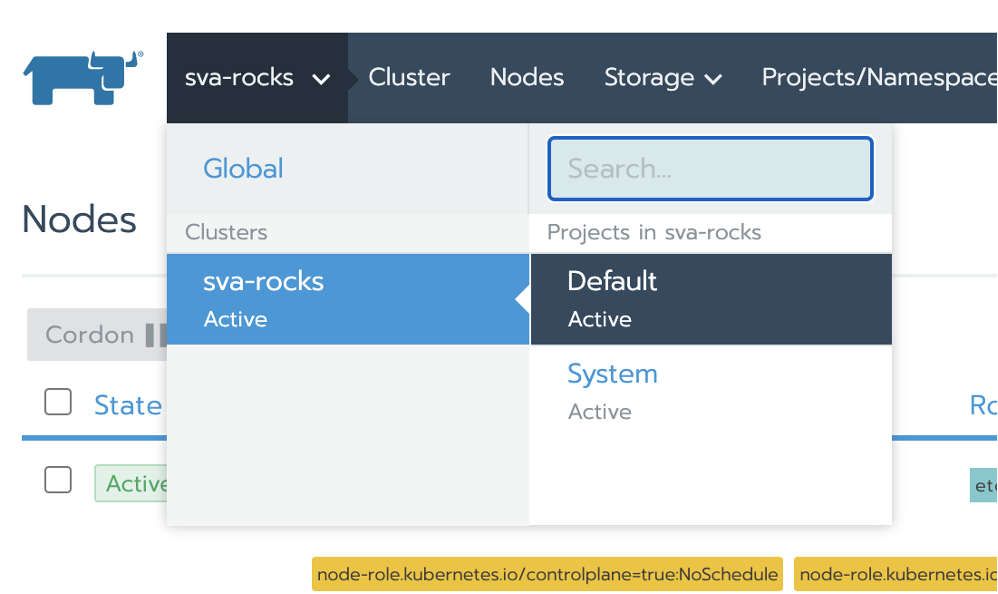
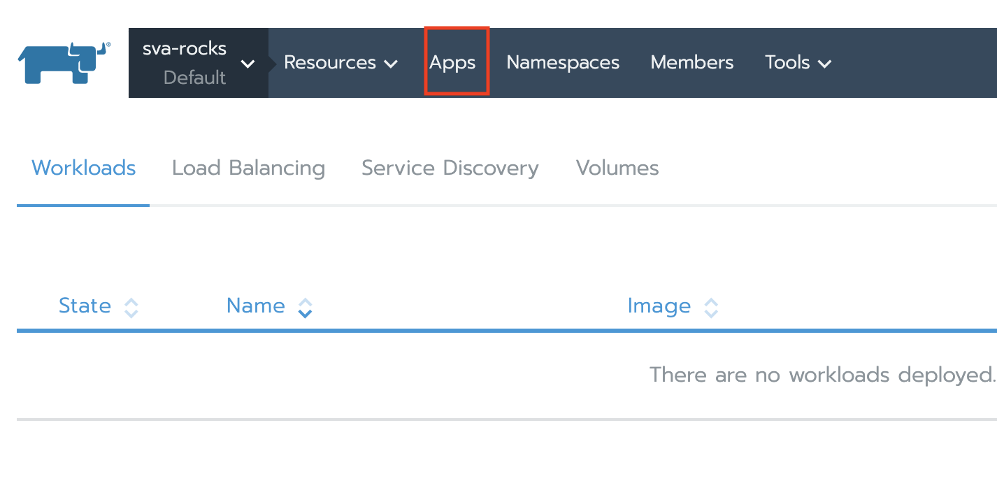
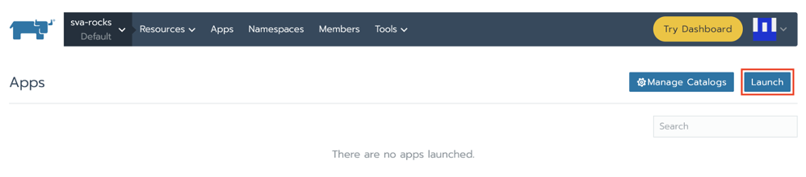

Um Longhorn auszurollen geht ihr als ersten in das Default Projekt eures Clusters:

 

Dort geht es dann weiter auf Apps:

 
Und anschließend auf Launch:

 

In der Suche suchen wir dann nach Longhorn und wählen dieses aus:

Anschließend wählen wir Launch:

Nun abwarten und Tee trinken:

